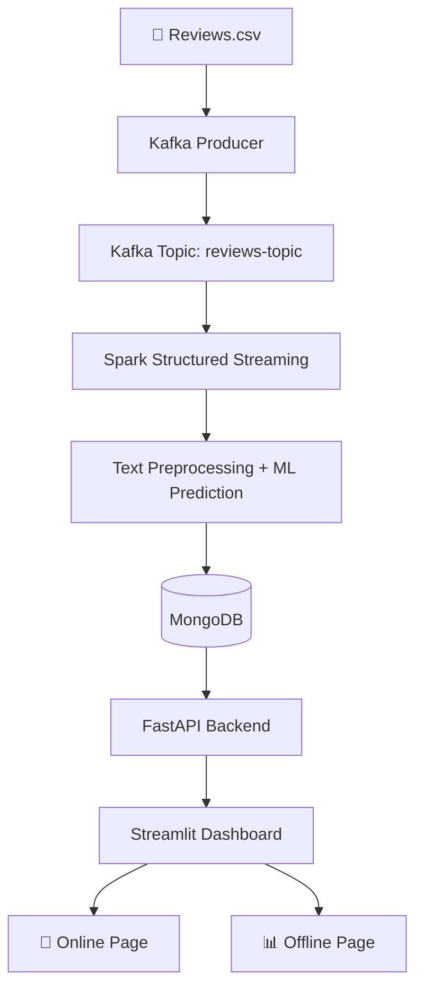

# 🛒 Amazon Review Sentiment Analysis — Real-Time Big Data Pipeline

> **IASD Mini-Project · Big Data 2025-2026**  
> Real-time sentiment analysis of Amazon product reviews using Apache Kafka, Spark Streaming, MongoDB, FastAPI & Streamlit.

---

## 📋 Table of Contents

- [Architecture](#architecture)
- [Technologies](#technologies)
- [Project Structure](#project-structure)
- [Quick Start](#quick-start)
- [Step-by-Step Setup](#step-by-step-setup)
- [API Endpoints](#api-endpoints)
- [Dashboard](#dashboard)
- [Kafka Commands](#kafka-commands)
- [Spark Commands](#spark-commands)
- [Dataset](#dataset)
- [ML Models](#ml-models)
- [Future Improvements](#future-improvements)

---

## 🏗️ Architecture

```
CSV Dataset (Amazon Fine Food Reviews)
          │
          ▼
┌─────────────────┐
│  Kafka Producer  │  ← Streams reviews at 1 review/Xs
│  (Python)        │
└────────┬────────┘
         │  reviews-topic (3 partitions)
         ▼
┌─────────────────┐
│  Apache Kafka   │  ← Message broker
│  + Zookeeper    │
└────────┬────────┘
         │
         ▼
┌─────────────────────────────┐
│  Spark Structured Streaming │  ← Real-time processing
│  • JSON parsing             │
│  • Text preprocessing       │
│  • ML prediction (sklearn)  │
└────────┬────────────────────┘
         │
         ▼
┌─────────────────┐
│    MongoDB      │  ← Stores all predictions
│  reviews-topic  │
└────────┬────────┘
         │
         ▼
┌─────────────────┐
│  FastAPI REST   │  ← /predictions /stats /product/{id}
└────────┬────────┘
         │
         ▼
┌─────────────────────────────┐
│     Streamlit Dashboard     │
│  📡 Online  — Live stream   │
│  📊 Offline — Analytics     │
└─────────────────────────────┘
```

### Mermaid Architecture Diagram



---

## 🧰 Technologies

| Component        | Technology                     | Version  |
|------------------|--------------------------------|----------|
| Message Broker   | Apache Kafka + Zookeeper       | 7.5.0    |
| Stream Processing| Apache Spark (PySpark)         | 3.5.0    |
| ML Library       | scikit-learn                   | 1.4.0    |
| Database         | MongoDB                        | 7.0      |
| Backend API      | FastAPI + Uvicorn              | 0.109.0  |
| Dashboard        | Streamlit + Plotly             | 1.31.0   |
| Containerization | Docker + Docker Compose        | latest   |
| Language         | Python                         | 3.11     |

---

## 📁 Project Structure

```
amazon-review-analysis/
│
├── data/                         # CSV dataset files
│   ├── Reviews.csv               # ← Download from Kaggle
│   └── test_reviews.csv          # Generated by notebook (10% test split)
│
├── notebooks/
│   └── 01_preprocessing_training.ipynb   # Full ML pipeline
│
├── producer/
│   ├── kafka_producer.py         # Real-time review streamer
│   └── setup_topic.py            # Kafka topic creation
│
├── streaming/
│   └── spark_streaming.py        # Spark Structured Streaming job
│
├── model/                        # Trained ML artifacts
│   ├── best_model.pkl            # Best trained model (joblib)
│   ├── tfidf_vectorizer.pkl      # TF-IDF vectorizer
│   ├── label_encoder.pkl         # Label encoder
│   └── model_metadata.json       # Model metrics & config
│
├── backend/
│   └── main.py                   # FastAPI REST API
│
├── dashboard/
│   └── app.py                    # Streamlit dashboard
│
├── database/
│   ├── mongo_client.py           # MongoDB client & queries
│   └── init_mongo.js             # DB initialization script
│
├── docker/
│   ├── Dockerfile.producer       # Producer image
│   ├── Dockerfile.spark          # Spark image
│   ├── Dockerfile.backend        # Backend image
│   ├── Dockerfile.dashboard      # Dashboard image
│   └── streamlit_config.toml     # Streamlit theme
│
├── config/
│   ├── settings.py               # Centralized config
│   └── logging_config.py         # Logging setup
│
├── requirements/
│   ├── producer.txt
│   ├── spark.txt
│   ├── backend.txt
│   └── dashboard.txt
│
├── logs/                         # Runtime logs
├── requirements.txt              # Full requirements (dev)
├── docker-compose.yml            # All services
├── .env                          # Environment variables
└── README.md
```

---

## 🚀 Quick Start

### Prerequisites

- Docker Desktop (or Docker Engine + Docker Compose)
- 8GB RAM minimum
- Dataset: Download `Reviews.csv` from [Kaggle](https://www.kaggle.com/snap/amazon-fine-food-reviews)

### 1. Clone & Setup

```bash
git clone https://github.com/YOUR_USERNAME/amazon-review-analysis.git
cd amazon-review-analysis

# Place Reviews.csv in the data/ directory
cp /path/to/Reviews.csv data/Reviews.csv
```

### 2. Train the Model (REQUIRED FIRST)

```bash
# Create a virtual environment
python -m venv venv
source venv/bin/activate  # Windows: venv\Scripts\activate

# Install dependencies
pip install -r requirements.txt

# Run the preprocessing & training notebook
jupyter notebook notebooks/01_preprocessing_training.ipynb
# Execute all cells — this generates:
#   model/best_model.pkl
#   model/tfidf_vectorizer.pkl
#   model/label_encoder.pkl
#   data/test_reviews.csv
```

### 3. Launch All Services

```bash
docker-compose up --build
```

### 4. Access the Application

| Service     | URL                         |
|-------------|------------------------------|
| Dashboard   | http://localhost:8501        |
| API Docs    | http://localhost:8000/docs   |
| API Health  | http://localhost:8000/health |
| MongoDB     | mongodb://localhost:27017    |
| Kafka       | localhost:9093               |

---

## 📡 Step-by-Step Setup

### Option A: Docker Compose (Recommended)

```bash
# Start all services
docker-compose up --build -d

# Check service status
docker-compose ps

# View logs
docker-compose logs -f kafka
docker-compose logs -f spark
docker-compose logs -f producer

# Stop all services
docker-compose down

# Stop and remove volumes (full reset)
docker-compose down -v
```

### Option B: Local Development

```bash
# Terminal 1: Start Zookeeper
# Terminal 2: Start Kafka
# Terminal 3: Setup topic
python producer/setup_topic.py

# Terminal 4: Start MongoDB (docker)
docker run -d -p 27017:27017 --name mongodb mongo:7.0

# Terminal 5: Start Spark Streaming
python streaming/spark_streaming.py

# Terminal 6: Start Producer
python producer/kafka_producer.py

# Terminal 7: Start API
uvicorn backend.main:app --host 0.0.0.0 --port 8000 --reload

# Terminal 8: Start Dashboard
streamlit run dashboard/app.py
```

---

## 🔌 API Endpoints

| Method | Endpoint                  | Description                          |
|--------|---------------------------|--------------------------------------|
| GET    | `/health`                 | Service health check                 |
| GET    | `/predictions`            | Paginated recent predictions         |
| GET    | `/stats`                  | Overall sentiment statistics         |
| GET    | `/product/{id}`           | Stats for a specific product         |
| GET    | `/sentiment-distribution` | Global or per-product distribution   |
| GET    | `/predictions-by-date`    | Monthly trend data                   |
| GET    | `/top-products`           | Top products by sentiment            |

### Example Requests

```bash
# Health check
curl http://localhost:8000/health

# Get 20 latest predictions
curl "http://localhost:8000/predictions?limit=20"

# Stats overview
curl http://localhost:8000/stats

# Product B001E4KFG0
curl http://localhost:8000/product/B001E4KFG0

# Sentiment distribution
curl http://localhost:8000/sentiment-distribution

# Top 5 positive products
curl "http://localhost:8000/top-products?sentiment=positive&limit=5"
```

---

## 📊 Dashboard

### 📡 Online Page (Live Stream)
- Auto-refreshing predictions table (every 5s)
- Live sentiment distribution donut chart
- KPI cards: total, positive, neutral, negative counts

### 📊 Offline Page (Analytics)
- **Global KPIs**: totals, percentages, product count
- **Sentiment Distribution**: global pie chart
- **Predictions by Date**: stacked bar chart by month
- **Product B001E4KFG0**: dedicated scoring analysis
- **Product Search**: any product by ID
- **Top Products**: positive & negative leaderboards

---

## ⚡ Kafka Commands

```bash
# Enter Kafka container
docker exec -it kafka bash

# List topics
kafka-topics --bootstrap-server localhost:9092 --list

# Describe topic
kafka-topics --bootstrap-server localhost:9092 --describe --topic reviews-topic

# Create topic manually
kafka-topics --bootstrap-server localhost:9092 \
  --create --topic reviews-topic \
  --partitions 3 --replication-factor 1

# Consume messages (debug)
kafka-console-consumer --bootstrap-server localhost:9092 \
  --topic reviews-topic --from-beginning | head -5

# Check consumer group lag
kafka-consumer-groups --bootstrap-server localhost:9092 \
  --describe --group spark-consumer-group
```

---

## 🌟 Spark Commands

```bash
# Submit Spark job manually
docker exec -it spark python streaming/spark_streaming.py

# View Spark logs
docker-compose logs -f spark

# Check checkpoint location
docker exec spark ls -la /tmp/spark_checkpoint/
```

---

## 📦 Dataset

**Amazon Fine Food Reviews** from [Kaggle](https://www.kaggle.com/snap/amazon-fine-food-reviews)

- ~568,000 reviews spanning 10+ years
- Columns: Id, ProductId, UserId, ProfileName, HelpfulnessNumerator, HelpfulnessDenominator, Score, Time, Summary, Text
- Target label:
  - `score < 3`  → **negative**
  - `score == 3` → **neutral**
  - `score > 3`  → **positive**

---

## 🤖 ML Models

All 4 models are trained and compared in the notebook:

| Model                  | Notes                              |
|------------------------|------------------------------------|
| Logistic Regression    | ⭐ Best for TF-IDF text features   |
| Naive Bayes            | Fastest, good baseline             |
| Linear SVM             | Strong for high-dimensional text   |
| Random Forest          | More parameters, good ensemble     |

- **Split**: 80% train / 10% validation / 10% test
- **Features**: TF-IDF (50k features, unigrams+bigrams, sublinear_tf)
- **Best model** selected automatically by F1-score and saved to `model/best_model.pkl`

---

## 🔮 Future Improvements

- [ ] MLflow experiment tracking
- [ ] Prometheus + Grafana monitoring
- [ ] Multi-broker Kafka cluster (3 brokers)
- [ ] Spark MLlib pipeline (native Spark ML)
- [ ] BERT / transformer-based sentiment model
- [ ] Real-time alerting for negative spikes
- [ ] CI/CD with GitHub Actions
- [ ] Kubernetes deployment (Helm charts)
- [ ] API authentication (JWT)
- [ ] WordCloud per product

---

## 👥 Team

IASD Big Data Group — 2025-2026

**Presentation date: Monday 11/05/2026**

---

## 📄 License

MIT License — Academic project for educational purposes.
=======
# GIT_PRJ
